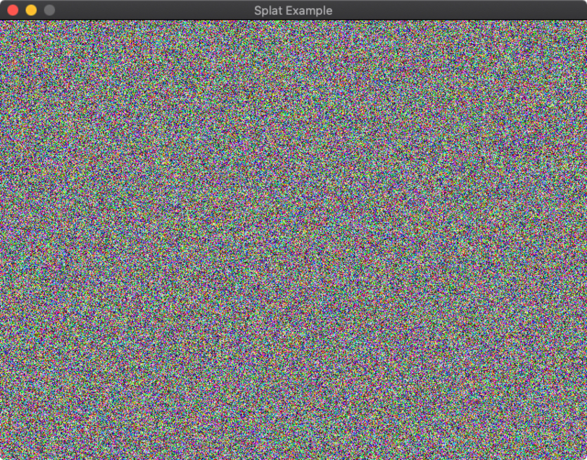
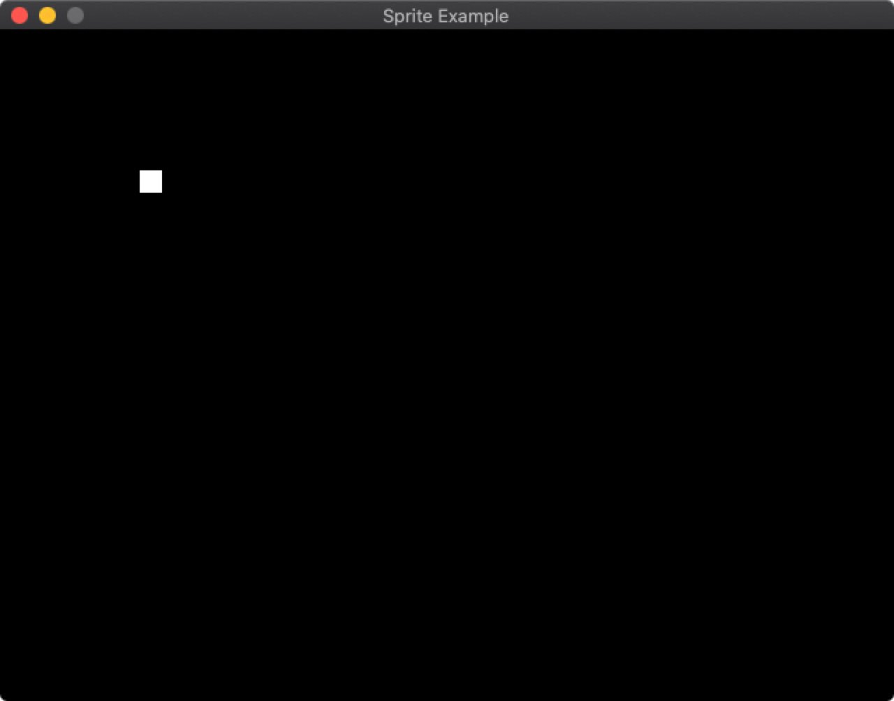
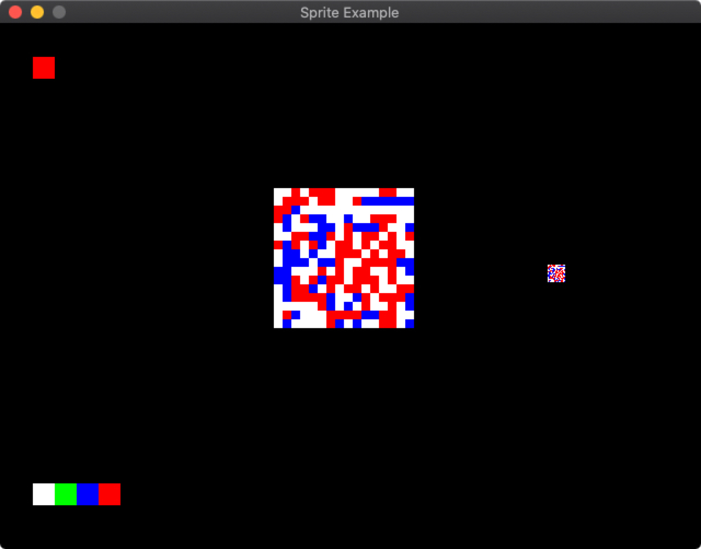
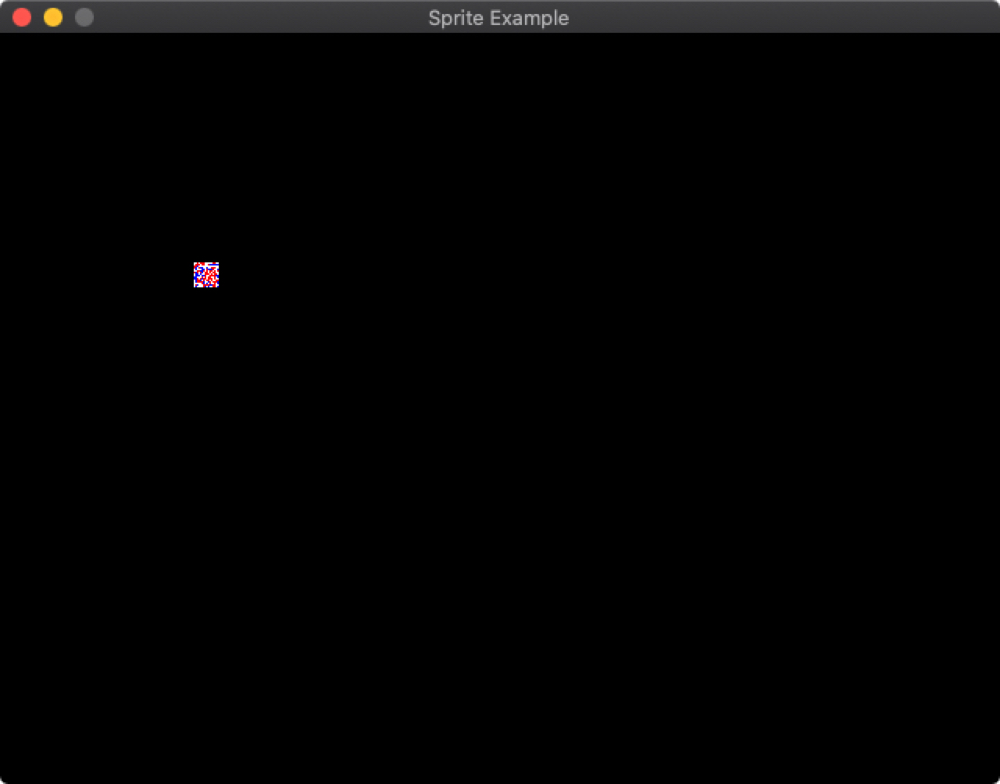
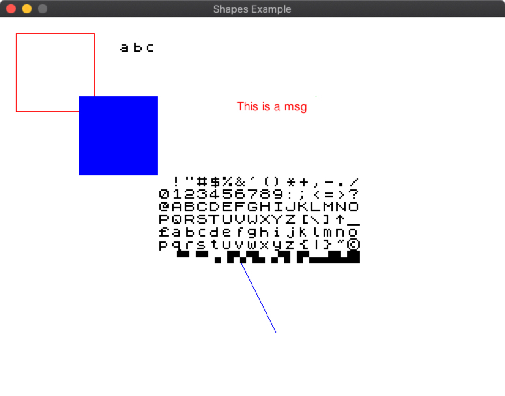

```UFCFGL-30-1 Programming in c++```

# Assignment

Fork and clone the repo [https://gitlab.uwe.ac.uk/br-gaster/assignment_2020](https://gitlab.uwe.ac.uk/br-gaster/assignment_2020).

Now follow the instructions below.

As normal all work should be peformed within your forked repo and sumitted to Gitlab.uwe.ac.uk.

## Introduction

A 2D interaction and drawing API is provided, which includes the following functionality:

- Keyboard input
- Mouse input
- Drawing of 2D shapes
- A Pixel buffer API
- Display images
- Display text

Some possible applications:

- [Tic-Tac-Toc](https://playtictactoe.org/)
- A clone of the game [2048](https://play2048.co/)
- A clone of the game Space Invaders
- The website ["I Need Practice Programming": 49 Ideas for Game Clones to Code ](https://inventwithpython.com/blog/2012/02/20/i-need-practice-programming-49-ideas-for-game-clones-to-code/) has loads of great options.
- A image editor, with the ability to save and restore images, etc.

A base applicaition is given in:

- **assignment/assignment.cpp**

and you should use this to being your assignment. Details of the framework are given in the API section below.

You can feel free to make it as complex as you choose. The marking scheme is designed to enable different levels of ability, with the base being get something up and running and build on it from there. However, to get a high mark it will need to have a level of complexity, that is beyond just handing input and display things no the screen.

### The marking scheme

- Implement a simple example program using the framework provided : 30 marks
- Your program supports interaction and state, e.g. allows the user to draw sprites, these sprites, can be saved, and restored: 20 Marks
- Your programs demostrates a complex application, e.g. it might be 2D game, such as 2048 or a simple Space Invaders: 20 Marks
- Your program is well structured, using multiple include files, and is documented, including source comments and a readme.md: 30 Marks

## Example applications

Three examples are provided as source to give you something to build upon and that demostrate different capabilities:

- *examples/splat.cpp*
- *examples/sprite.cpp*
- *examples/sprite.cpp*

See the sections on Windows and OS X for how to build these examples.

### Splat



Uses a framebuffer object to draw random pixels to the screen.

### Sprite

The beginnings of sprite editor. It opens with a window
display a single white sprite:



Pressing 2 will change to the sprite editor, where 
you can select from a colour palate on the bottom left,
and then draw in the expanded sprite in the middle:



Pressing 1 will change back to the sprite display, and will be updated to reflect any changes. The sprite can be moved around with the arrow keys:



Currently this is very basic, but it could form a starting point for:

- A more feature complete sprite editor, which could include saving, loading, sprites; tools to edit the sprite, such as fill, cut, paste; different sizes of sprites; more complex colour selection; and so on.
- Used as the basis for a simple sprite editor in a game tool kit, which combined with a map editor could provide an all in one game development platform.

### Shapes

The shapes example provides a demostration of the different features provided for drawing shapes and text:



## Windows

To make it slightly easier to build both the examples and the assigment itself two Bat files are provided:

- windows_build\examples.bat
- windows_build\assignment.bat

building the examples and assignment, respectively. Unlike the assignments you do not build with VS Code.

To build and run the examples, or assignment, you first change into the *windows_build* directory:

```bash
cd windows_build
```

and then run the particular bat file, e.g. to build the examples you would run:

```bash
.\examples.bat
```

and for the assigment:

```bash
.\assignments.bat
```

Run **examples.bat** builds the executables:

- **shapes.exe**
- **splat.exe**
- **sprite.exe**

and *assignment.bat* builds:

- **assigment.exe**

To run an example or the assigment, simply run the command, e.g. **./shapes.exe**, 
in the same directory. (Note: it is important that you run the executables in the
**window_build** directory.)

## OS X

To make it slightly easier to build both the examples and the assigment itself a Makefile is provided:

- **Makefile**

To build and examples and assignment simple type

```bash
make
```

in the root directory. This will build the resulting 
executables in the directory **build**. **build** will
contain the example executables:

```bash
./build/shapes
./build/splat
./build/sprite
```

and for the assigment:

```bash
./build/assignment
```

To run an example or the assigment, simply run the executable from the root directory, e.g. **./build/shapes**. (Note: it is important that you run the executables from the *root* directory.)

## assignment/assignment.cpp

In **assignment\assignment.cpp** you will see the definition of MyApp class as follows:

```c++
class MyApp: public uwe::App {
private:
public:
    // Constructor for your application
    // Window width
    // Window height
    // Window title
    MyApp(int width, int height, std::string title);
    ~MyApp();

    // this function is called once when the framework
    // begins running. You can use it to preform setup
    // of your app.
    void begin() override;

    // The following 2 functions are called at 60hz,
    // i.e. 60 times a second. update is called before
    // draw. You should update you applications state
    // during update and call any drawing functions
    // during draw.
    void update() override;
    void draw() override;

    // Everytime a key is pressed this funciton is 
    // called
    void key_pressed(uwe::Scancode scancode, bool repeat) override;

    // Everytime a mouse button is pressed this 
    // function is called
    void mouse_pressed(int x, int y, uwe::Button button) override;

    // Everytime a mouse button is released this 
    // function is called
    void mouse_released(int x, int y, uwe::Button button) override;

    // Everytime the mouse is moved this function
    // is called
    void mouse_moved(int x, int y) override;
};
```

Default or empty implementations for all these functions are provided in **assignments/assignments.cpp**:

```c++
MyApp::MyApp(int width, int height, std::string title) {
    init(width, height, title);
}

MyApp::~MyApp() {

}

void MyApp::begin() {
    
}

void MyApp::update() {

}

void MyApp::key_pressed(uwe::Scancode scancode, bool repeat) {
    switch (scancode) {
         default: {
            // nothing see here
        }
    }
}

void MyApp::mouse_pressed(int x, int y, uwe::Button button) {
}
    
void MyApp::mouse_released(int x, int y, uwe::Button button) {
}
    
void MyApp::mouse_moved(int x, int y) {
}

void MyApp::draw() {
    clear(uwe::Colour::black());
}
```

Your task is to fill these functions out to meet the requirments of your chosen application. Each of the provided examples follow this approach and give ideas of how to use different elements of the framework.

# Framework

## Colours and Rectangles

Colour can be defined with the Colour class, which 
contain a red, green, and blue component, along with an alpha value, that defines the opacity. 

Some predefined colours are provided.

```cpp
class Colour {
    public:
        uint8_t blue_;
        uint8_t green_;
        uint8_t red_;
        uint8_t alpha_;

        Colour(uint8_t red, uint8_t green,  uint8_t  blue, uint8_t alpha);

        static Colour red();
        static Colour green();
        static Colour blue();
        static Colour white();
        static Colour black();
    };
```

There is a utility function to make colours:

```c++
Colour make_colour(uint8_t red, uint8_t green, uint8_t blue, uint8_t alpha);
```

Lots of the drawing functions take colours as arguments.

A type of rectangles is provided:

```c++
struct Rect {
    int x;
    int y;
    int width;
    int height;
}
```

and a utility function to make rectangles is defined:

```c++
Rect make_rect(int x, int y, int width, int height);
```

## Images and Fonts

Types are provided for Images and Fonts:

```c++
Image
```

and 

```c++
Font
```

respectively.

Functions for working on images are as follows:

```c++
// load a PNG file from path given
Image create_image(std::string path);

// Create an empty image of size width and height
Image create_image(int width, int height);

// Delete an existing image
void delete_image(Image image);
// get image size
void get_image_size(Image image, int *width, int *height);

// Draw an part of an image to part of the screen
void draw_image(Image image, Rect src, Rect dest);
```

Functions for working with fonts are as follows:

```c++
// Create a font from a True Type Font File (.ttf)
// For a given point size and colour.
// If you want different colours or point size, then 
// a new font needs to be created.
Font create_font(std::string path, int point_size, Colour colour);

// Display a string using a given font at specified position.
void draw_font(Font font, std::string msg, float x, float y) 
```
An example TTF can be found in **./assets/fonts/FreeSans.ttf**. Additional fonts can be found on the internet.

## Framebuffer

A [Framebuffer](https://en.wikipedia.org/wiki/Framebuffer) is a pixel abstraction of the window, 
in which colour values can be directly written or read.

There is a single framebuffer. You can use a framebuffer for sprite style operations.

Functions for managing the framebuffer are as follows:

```c++
// Width of framebuffer, for this case it will be the 
// same as window width.
int get_framebuffer_width();

// Height of framebuffer, for this case it will be the 
// same as window height.
int get_framebuffer_height();

// Sets a pixel in the framebuffer to a given colour.
void set_framebuffer(int x, int y, Colour colour);

// Clears the framebuffer with a specifed colour.
void clear_framebuffer(Colour colour);

// Draw the current framebuffer to the screen/window.
void blit_framebuffer();
```

## Drawing

The following functions can be used to draw basic shapes.

```c++
// Clear the screen with to a specific colour.
void clear(Colour colour);

// Set the colour of the drawing pen
void set_draw_color(Colour colour);

// Draw rectangles with lines
void draw_rect(int x, int y, int width, int height);
void draw_rect(Rect rect);

// Draw filled rectangles
void draw_rect_fill(int x, int y, int width, int height);
void draw_rect_fill(Rect rect);

// Draw a line
void draw_line(int x1, int y1, int x2, int y2);
// Draw a point
void draw_point(int x, int y);
```